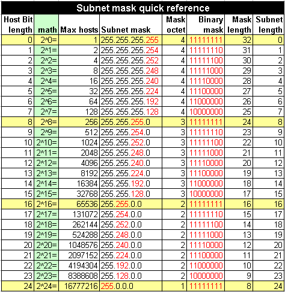

## InterNIC 將整個 IP 網段分為五種等級， 每種等級的範圍主要與 IP 那 32 bits 數值的前面幾個位元有關，基本定義如下：##

```css
以二進位說明 Network 第一個數字的定義：
Class A : 0xxxxxxx.xxxxxxxx.xxxxxxxx.xxxxxxxx  => NetI_D 的開頭是 0
          |--net--|---------host------------|
Class B : 10xxxxxx.xxxxxxxx.xxxxxxxx.xxxxxxxx  => NetI_D 的開頭是 10
          |------net-------|------host------|
Class C : 110xxxxx.xxxxxxxx.xxxxxxxx.xxxxxxxx  => NetI_D 的開頭是 110
          |-----------net-----------|-host--|
Class D : 1110xxxx.xxxxxxxx.xxxxxxxx.xxxxxxxx  => NetI_D 的開頭是 1110
Class E : 1111xxxx.xxxxxxxx.xxxxxxxx.xxxxxxxx  => NetI_D 的開頭是 1111

五種分級在十進位的表示：
Class A :   0.xx.xx.xx ~ 127.xx.xx.xx
Class B : 128.xx.xx.xx ~ 191.xx.xx.xx
Class C : 192.xx.xx.xx ~ 223.xx.xx.xx
Class D : 224.xx.xx.xx ~ 239.xx.xx.xx
Class E : 240.xx.xx.xx ~ 255.xx.xx.xx
```

Class A ⇒ IPv4 地址有 8 個網路字首位，後三個八位為主機地址

Class B ⇒ IPv4 地址有 16 個網路字首位，後兩個八位為主機地址

Class C ⇒ IPv4 地址有 24 個網路字首位，後八位為主機地址

<br>

**私有 IP 也分別在 A, B, C 三個 Class 當中各保留一段作為私有 IP 網段，用於企業內部網路中**

```css
Class A：10.0.0.0    - 10.255.255.255
Class B：172.16.0.0  - 172.31.255.255
Class C：192.168.0.0 - 192.168.255.255
```
<br>

網路遮罩目的：控制網段範圍，細分網段，子網路切分



<br>

### IP 位址中的特殊位址 ###
1. Network Address (網路位址)
**Host ID 全部為 0 $\rightarrow$ Network Address (網段位址)**
代表： 整個網段本身
用途：
 - 路由判斷：路由器根據 Network Address 決定封包轉發方向，無需知道具體的 Host ID
 - 網路管理：用於標識和記錄 IP 區塊（例如：192.168.1.0/24）

2. Broadcast Address (廣播位址)
**Host ID 全部為 1 $\rightarrow$ Broadcast Address (廣播位址)**
代表： 網段內的所有設備
用途：
 - 尋找設備
    - ARP 協定：查詢設備的 MAC 位址
    - DHCP：客戶端尋找伺服器以取得 IP
 - 服務發現
    - 設備透過廣播尋找網段內的特定服務（如印表機、伺服器）
 - 提升效率
    - 一次廣播即可通知所有設備，比逐一發送 unicast 更有效率
  


<br><br><br>
---


192.168.5.5/255.255.255.0 ⇒ 192.168.5.0-192.168.5.255

172.16.1.4/255.255.255.248 ⇒ 172.16.1.0-172.16.1.7

10.0.0.1/255.255.255.255

172.16.1.12/255.255.255.248 ⇒ 172.16.1.8-172.16.1.15


